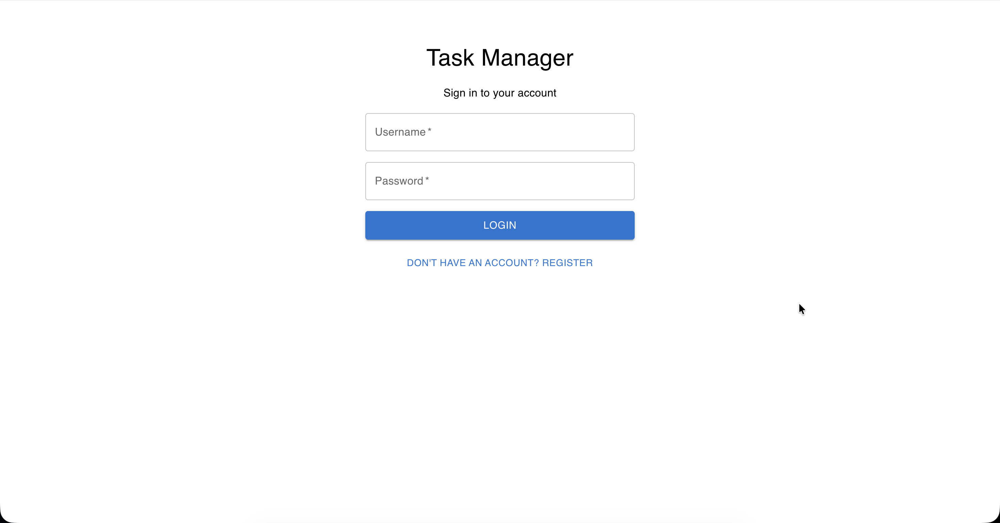
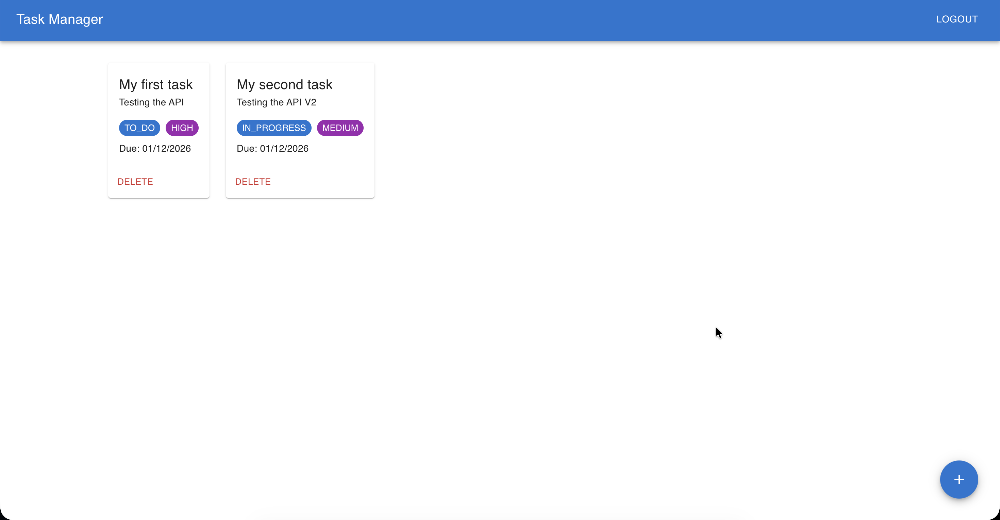
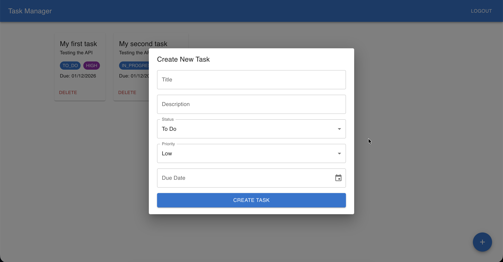

# Task Manager
 
A full-stack task management application built with Spring Boot and React. Users can register, log in, and manage their own personal tasks with full CRUD functionality.
 
---
 
## Tech Stack
 
**Backend**
- Java 21
- Spring Boot 3.5
- Spring Security with JWT authentication
- Spring Data JPA / Hibernate
- PostgreSQL
- Lombok
- Gradle
**Frontend**
- React 19
- Vite
- Material UI (MUI)
- Axios
- React Router
---
 
## Features
 
- User registration and login with JWT-based authentication
- Passwords hashed with BCrypt
- Create, view, and delete tasks
- Each task has a title, description, status, priority, and due date
- Users can only access their own tasks
- Fully responsive UI built with Material UI
- Protected routes — dashboard only accessible when logged in
---
 
## Screenshots
 



 
---
 
## Prerequisites
 
- Java 21
- PostgreSQL
- Node.js & npm
- Gradle
---
 
## Getting Started
 
### Backend
 
1. Clone the repository:
   ```bash
   git clone https://github.com/shahir145/task-manager.git
   cd task-manager/taskmanager
   ```
 
2. Create a PostgreSQL database:
   ```sql
   CREATE DATABASE taskmanager;
   ```
 
3. Update `src/main/resources/application.properties` with your database credentials:
   ```properties
   spring.datasource.url=jdbc:postgresql://localhost:5432/taskmanager
   spring.datasource.username=your_username
   spring.datasource.password=your_password
   ```
 
4. Run the backend:
   ```bash
   ./gradlew bootRun
   ```
 
The API will start on `http://localhost:8080`.
 
---
 
### Frontend
 
1. Navigate to the frontend directory:
   ```bash
   cd task-manager/taskmanager-frontend
   ```
 
2. Install dependencies:
   ```bash
   npm install
   ```
 
3. Start the development server:
   ```bash
   npm run dev
   ```
 
The frontend will start on `http://localhost:5173`.
 
---
 
## API Endpoints
 
### Auth
 
| Method | Endpoint | Description |
|--------|----------|-------------|
| POST | `/auth/register` | Register a new user |
| POST | `/auth/login` | Login and receive a JWT token |
 
### Tasks
 
> All task endpoints require a valid JWT token in the `Authorization: Bearer <token>` header.
 
| Method | Endpoint | Description |
|--------|----------|-------------|
| GET | `/tasks` | Get all tasks for the current user |
| POST | `/tasks` | Create a new task |
| GET | `/tasks/{id}` | Get a task by ID |
| PUT | `/tasks/{id}/title` | Update task title |
| PUT | `/tasks/{id}/description` | Update task description |
| PUT | `/tasks/{id}/status` | Update task status |
| PUT | `/tasks/{id}/priority` | Update task priority |
| PUT | `/tasks/{id}/dueAt` | Update task due date |
| DELETE | `/tasks/{id}` | Delete a task |
 
---
 
## Project Structure
 
### Backend
```
src/main/java/com/miniproject/taskmanager/
├── config/          # Security configuration
├── controller/      # REST controllers
├── dto/             # Data Transfer Objects
├── exceptions/      # Custom exceptions
├── model/           # JPA entities
├── repository/      # Spring Data repositories
├── security/        # JWT filter and utility
└── service/         # Business logic
```
 
### Frontend
```
src/
├── api/             # Axios instance
├── components/      # Reusable components
├── pages/           # Page components
└── App.jsx          # Routing
```
 
---
 
## Author
 
[shahir145](https://github.com/shahir145)